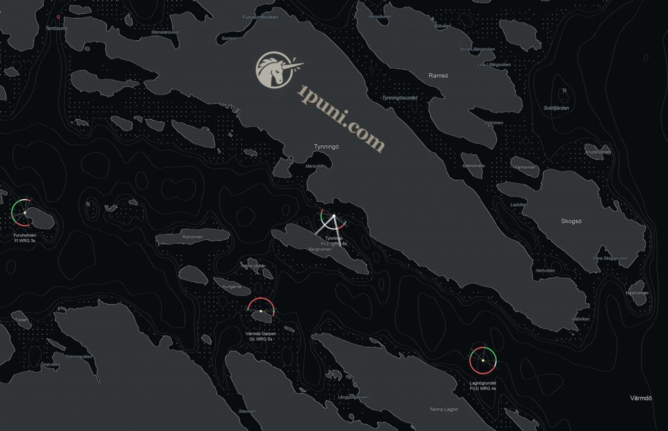

# 1puni — Tynningö

An additional, offline native screen saver commissioned by Evita on 2026-09-30:
put 1puni.com and its logo into Tynningö as though they belong to the island.

The original unicorn emblem and a Georgia Bold domain inscription follow the
island's northwest–southeast axis. Muted brass-grey ink (#ada68c), a fine recessed
shadow, charcoal land and near-black water keep the composition quiet. The
inscription is attached to the chart coordinate system, never the screen edge.
The real coastline, chart plate, lighthouse timing and land-occlusion mask are
unchanged. The logo is the original asset from 1puni.com, rendered as an ink mask
once at load time; no network access or image processing occurs per frame.

The separate bundle identifier `com.1puni.tynningo` preserves both the old saver
and its preferences. Options includes the unbranded Tynningö chart for comparison.
The branded scene is the fresh-install default. Source attribution is in Options.

## Build and install

From the repository root, with Apple Command Line Tools and Node installed:

```sh
make test
make brand
make install-brand
```

The installation is user-scoped at
`~/Library/Screen Savers/1puni-Tynningo.saver`.
Choose **1puni — Tynningö** in System Settings → Screen Saver.

`inscription.json` and the original emblem travel in the scene's `.include/`
directory. The optional sidecar declares chart-relative centre, width in logical
chart points and rotation. Other scenes do not acquire the inscription.

The bundle is ad-hoc signed, like the original local saver. This build does not
publish a website change or a GitHub binary release.

## Verification

The native renderer was inspected at 3456 × 2234, 1920 × 1080 and 960 × 620.
All 29 Swift tests and two Node tests pass, including chart-relative inscription
placement during resize and animation. The universal bundle loads through its
principal class, runs a complete six-second loop per scene and displays credits.
A separate Objective-C class and Swift module prevent collisions when the original
and branded savers are loaded into the same process.


